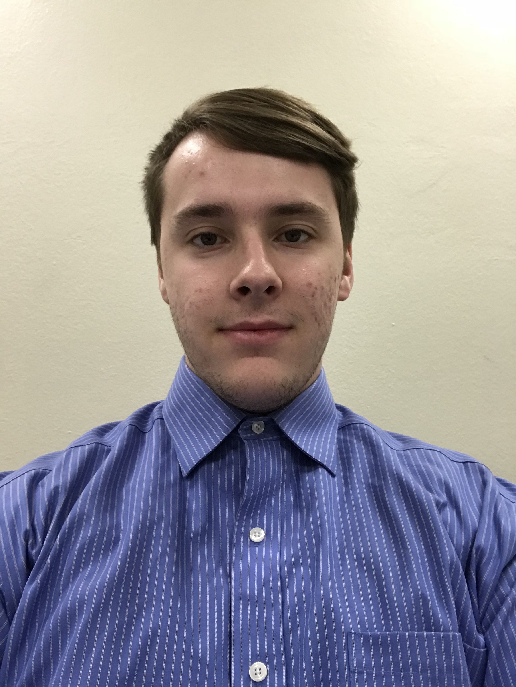

## Hack OH/IO 2019 Project
Repository for the Hack OH/IO Hackathon 2019

## Introduction

Will populate after the beginning of Hackathon.

## Who We Are

| [Hunter Figgs](https://github.com/hfiggs)  | [Max Giffin](https://github.com/maxg66) | [Evan Horsley](https://github.com/evy0311)  | [Ryan O'Leary](https://github.com/olearyryan08) |
| ------------- | ------------- | ------------- | ------------- |
|  |   |   |   |

## Our Story

We're four roommates who have lived together since the beginning of our college careers in August of 2018. The name "341 Boys" was given to use because, well, we were in room number 341, and we're all boys (men, rather). So, 341 Boys has been our name, and we're hoping that for this project, coding is the game!

## License

[GPLv3](http://www.gnu.org/licenses/gpl-3.0.txt)